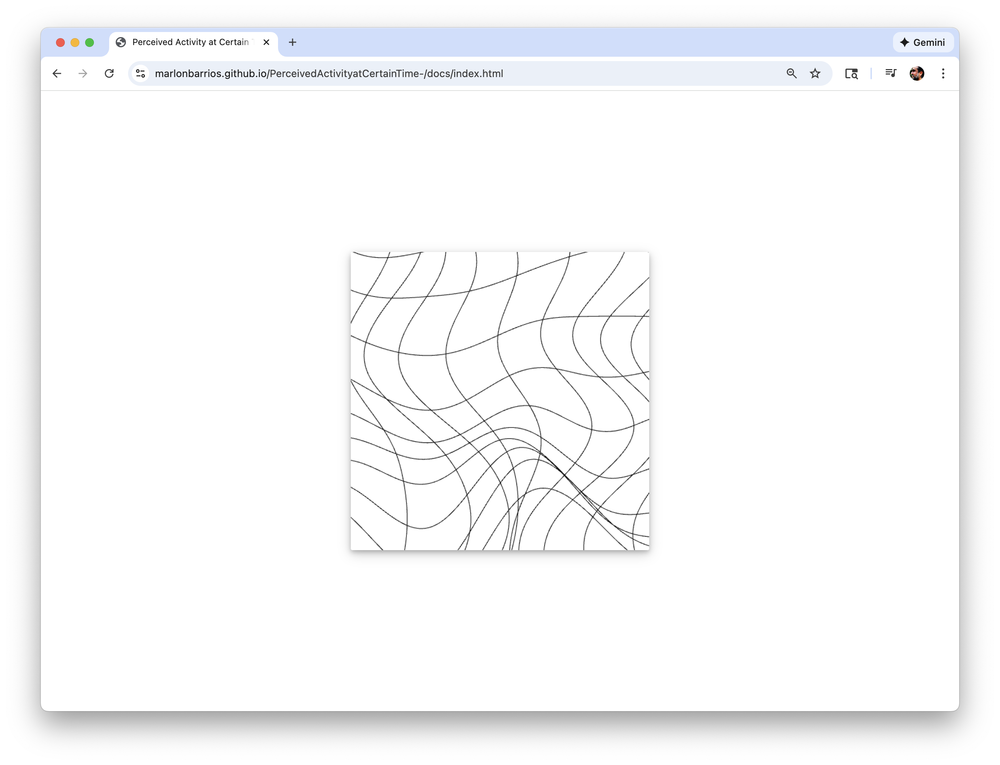

# Perceived Activity at Certain Time

Generative art sketch featuring animated noise waves that respond to the time of day. Wave activity peaks at midday and reaches zero at midnight, creating a visual representation of perceived daily activity.



## Setup

1. Install dependencies:
```bash
npm install
```

## Usage

### Development Mode
Run the sketch in development mode (opens in browser):
```bash
npm start
```

Or directly:
```bash
canvas-sketch sketch.js --open
```

### Export Mode
Export frames as images:
```bash
npm run export
```

Or directly:
```bash
canvas-sketch sketch.js --output=./output --build
```

## Features

- **Time-based activity**: Wave activity varies throughout the day
  - **Midday (12:00)**: Maximum wave activity
  - **Midnight (00:00)**: Zero activity (straight lines)
  - Smooth transition throughout the 24-hour cycle
- **Bidirectional waves**: Horizontal and vertical waves create a grid pattern
- **Simplex noise**: Smooth wave generation using 3D noise
- **Canvas-sketch framework**: Enhanced export and development workflow

## Technical Details

- Canvas size: 512 × 512 pixels
- Uses native Canvas 2D API (no p5.js dependency)
- Activity multiplier calculated using cosine function based on current time
- Waves animated continuously with time-based noise

## Original

Originally created with p5.js, now converted to canvas-sketch for enhanced export and development workflow.

Programmed by [Marlon Barrios Solano](https://marlonbarrios.github.io/)
